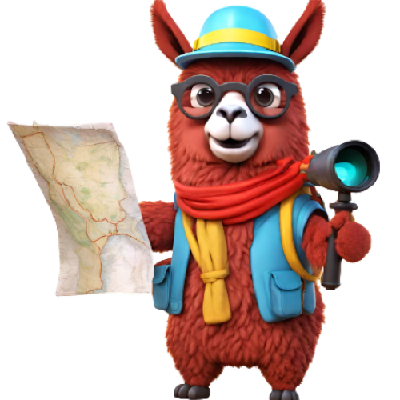

# GeoChat : Grounded Large Vision-Language Model for Remote Sensing [CVPR-2024]
<p align="center">
    
</p>


## Overview

GeoChat is the first grounded Large Vision Language Model, specifically tailored to Remote Sensing(RS) scenarios. Unlike general-domain models, GeoChat excels in handling high-resolution RS imagery, employing region-level reasoning for comprehensive scene interpretation. Leveraging a newly created RS multimodal dataset, GeoChat is fine-tuned using the LLaVA-1.5 architecture. This results in robust zero-shot performance across various RS tasks, including image and region captioning, visual question answering, scene classification, visually grounded conversations, and referring object detection.

---
## Contents
- [Install](#install)
- [Model Zoo](https://github.com/mbzuai-oryx/GeoChat/blob/main/docs/MODEL_ZOO.md)
- [Dataset](https://huggingface.co/datasets/MBZUAI/GeoChat_Instruct/blob/main/GeoChat_Instruct.json)
- [Train](#train)
- [Evaluation](#evaluation)

## Install

1. Clone this repository and navigate to GeoChat folder
```bash
git clone https://github.com/Suhail-SSRC/GeoChat.git
cd GeoChat
```

2. Install Package
```Shell
conda create -n geochat python=3.10 -y
conda activate geochat
pip install --upgrade pip  # enable PEP 660 support
pip install -e .
```

3. Install additional packages for training cases
```
pip install ninja
pip install flash-attn --no-build-isolation
```

4. For QVLM Quantization (4bits)
```
conda create -n QVLM python=3.10 -y
conda activate QVLM
pip install --upgrade pip  # enable PEP 660 support
pip install -e project_QVLM.toml
pip uninstall bitsandbytes
cd custom_bitsandbytes
python setup.py install
```

## GeoChat Weights and Demo
Please check out our [Model Zoo](https://github.com/mbzuai-oryx/GeoChat/blob/main/docs/MODEL_ZOO.md) for all public GeoChat checkpoints, and check [LoRA.md](https://github.com/mbzuai-oryx/GeoChat/blob/main/docs/LoRA.md) for instructions on how to run the demo and training.

## Train

GeoChat training consists of visual instruction tuning using GeoChat_Instruct Dataset: 318k Vicuna-generated multimodal instruction-following data, finetuned over the pretrained weights of LlaVA-v1.5.

We train GeoChat on 3 A100 GPUs with 40GB memory. To train on fewer GPUs, you can reduce the `per_device_train_batch_size` and increase the `gradient_accumulation_steps` accordingly. Always keep the global batch size the same: `per_device_train_batch_size` x `gradient_accumulation_steps` x `num_gpus`.

### Hyperparameters
We use a similar set of hyperparameters as Vicuna in finetuning.  Both hyperparameters used in pretraining and finetuning are provided below.

| Hyperparameter | Global Batch Size | Learning rate | Epochs | Max length | Weight decay |
| --- | ---: | ---: | ---: | ---: | ---: |
| GeoChat-7B | 144 | 2e-5 | 1 | 2048 | 0 |

### Pretrain (feature alignment)

We use the pretrained projector from LLaVAv1.5, which is trained on 558K subset of the LAION-CC-SBU dataset with BLIP captions. It takes around 3.5 hours for LLaVA-v1.5-7B.

- `--mm_projector_type mlp2x_gelu`: the two-layer MLP vision-language connector.
- `--vision_tower openai/clip-vit-large-patch14-336`: CLIP ViT-L/14 336px.

### Visual Instruction Tuning

1. Prepare data

Please download the annotation of the final mixture of our instruction tuning data [GeoChat_Instruct.json](https://huggingface.co/datasets/MBZUAI/GeoChat_Instruct/blob/main/GeoChat_Instruct.json), and download the split image zips from the [hugging face](https://huggingface.co/datasets/MBZUAI/GeoChat_Instruct). Save the multiple image zips in a single folder and run the following command to merge them:
```Shell
cat images_parta* > images.zip
```
Unzip the images.zip file to a folder and give the folder's path in [finetune_lora.sh](https://github.com/mbzuai-oryx/GeoChat/blob/main/scripts/finetune_lora.sh).

2. Start training!

Visual instruction tuning takes more time due to the increased resolution of CLIP to 504X504. It takes around ~25 hours to finetune GeoChat-7B on 3x A100 (40G).

Training script with DeepSpeed ZeRO-3: [`finetune_lora.sh`](https://github.com/mbzuai-oryx/GeoChat/blob/main/scripts/finetune_lora.sh).

Options to note:

- `--mm_projector_type mlp2x_gelu`: the two-layer MLP vision-language connector.
- `--vision_tower openai/clip-vit-large-patch14-336`: CLIP ViT-L/14 336px.
- `--image_aspect_ratio pad`: this pads the non-square images to square, instead of cropping them; it slightly reduces hallucination.
- `--group_by_modality_length True`: this should only be used when your instruction tuning dataset contains both language (e.g. ShareGPT) and multimodal (e.g. LLaVA-Instruct).
- 
## Evaluation

We evaluate GeoChat on a diverse set of 7 benchmarks. To ensure the reproducibility, we evaluate the models with greedy decoding. We do not evaluate using beam search to make the inference process consistent with the chat demo of real-time outputs.
See [Evaluation.md](https://github.com/mbzuai-oryx/GeoChat/blob/main/docs/Evaluation.md).


